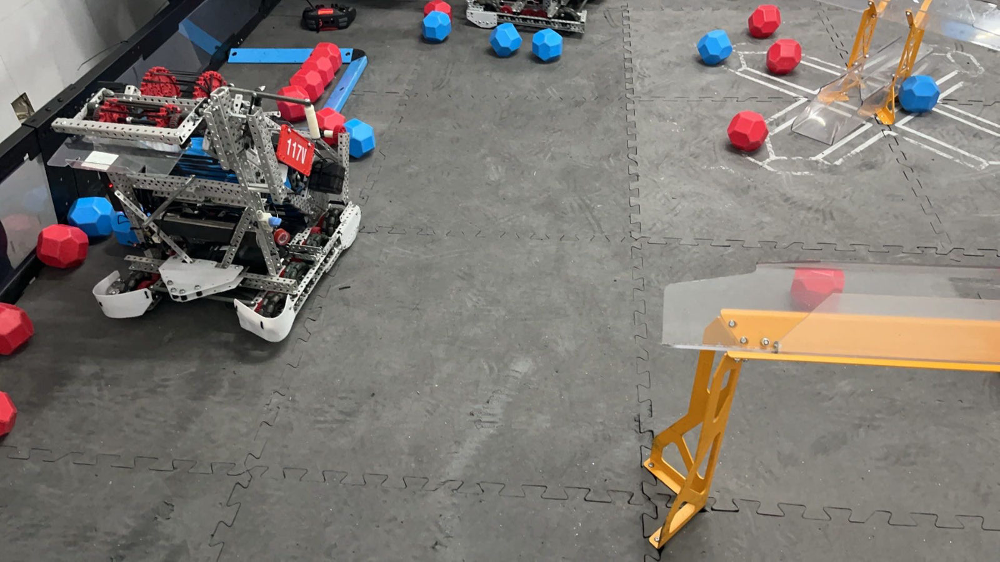

# VEX Robotics: four seasons, from newcomer to captain

**Four seasons of VEX V5 at my school, told through the robots, the code and the decisions.** I joined in Grade 9 carrying parts and filming matches, became the team's lead programmer in Grade 10, and have captained team **117V "Virtus Pro"** since Grade 11. This repository keeps the evidence: three generations of one robot and why each was replaced, every autonomous routine I wrote, the engineering notebook, the CAD, and what leading the team involved.

Yu Chen (Roger) · Grade 12 · Suzhou Foreign Language School (SFLS), China

---

## Four seasons at a glance

| Season | Game | Team · my role | What we built | Highlight |
|---|---|---|---|---|
| 2023–24 · Grade 9 | *Over Under* | 117C · new member: parts, scouting, filming | Four versions of a catapult/climbing robot, V2.0 → V4.0 | Four robot versions in one season |
| 2024–25 · Grade 10 | *High Stakes* | 117C · **programmer → lead programmer**, CAD | Conveyor and lift-arm robot "V2.0" | 908 lines of autonomous code; a hand-written feedback controller for the lift arm |
| **2025–26 · Grade 11** | ***Push Back*** | **117V · captain, lead programmer, CAD** | **Three generations**: Gen 1 rollers → Gen 2 ramp → Gen 3 S-path | **Division 2 champion and overall runner-up**, VEX Robotics Invitational & VEX Academy National League (61 teams, 9 provinces); then the VEX World Championship China selection (Shanghai, Feb 2026) |
| 2026–27 · Grade 12 | *Override* | 117V · captain | In progress | Off-season: found why our drives never "arrived", and built a simulator now used by every team in the club |

## Start here

1. **[The 2025–26 design log](seasons/2025-26-push-back/design-log.md).** Three robots in one season. What each one got wrong, what we changed, and why, including the design we replaced even after it had won a competition.
2. **[The autonomous code](seasons/2025-26-push-back/code/README.md).** How the routes were planned, how they changed after real matches, and how the code grew and was cut back.
3. **[Reading our control template line by line](https://github.com/Rogercy-whoop/vex-auton-visualizer/blob/main/docs/FINDINGS.md)** (July 2026). The discovery that every drive move had been ending on its timeout, never on arrival.

---

## The story

**Grade 9: learning the machine.** I joined the SFLS robotics club in 2023, on team 117C. My jobs were sourcing parts, scouting other teams and filming matches. That season the club's robot went through four versions (V2.0, V2.5, V3.0, V4.0), changing the drive speed, the scoring and climbing mechanisms, and the motor budget along the way. Each version was documented as a step-by-step build guide. → [2023–24](seasons/2023-24-over-under/README.md)

**Grade 10: writing the code.** In 2024–25 I became the team's programmer, then its lead programmer. Between March and May 2025 our autonomous code grew from 699 to 908 lines, with separate routines for attacking and defending, for qualification and final matches, and for skills. I also wrote a feedback controller of my own: a proportional loop that drives the lift arm to 37° from a rotation sensor. With our mentor I modelled the robot in SolidWorks. → [2024–25](seasons/2024-25-high-stakes/README.md)

**Grade 11: captain, and three robots.** In 2025–26 I captained 117V. We built **Gen 1**, found it could not store enough blocks and that its rubber-band rollers tangled with other robots, and replaced it with **Gen 2**: a new drivetrain, a rubber-wheel intake on a floating rail, double-row storage and a belt-and-paddle transfer. In August our club's sister team 117B took a robot of the Gen 2 design to the WRCT 2025 selection and won the high-school division; I helped them during development, in the pits and with their code. Watching that design compete showed us three problems: blocks leaking from the double row, an autonomous with no real advantage, and side-by-side jams. So we rebuilt ours as **Gen 3**, with a single S-shaped storage channel and rollers deliberately run at different speeds. In November, Gen 3 **won Division 2 and finished runner-up overall** at a national invitational in Suzhou. During that event I explained a disputed result to the referees on my own, in my second language; they ordered a rematch, and we won it. In February we competed at the VEX World Championship China selection in Shanghai. → [2025–26](seasons/2025-26-push-back/README.md) · [leadership, in my own words](leadership.md)

**After the season: finding out why.** After two seasons of tuning autonomous routines by trial and error, in July 2026 I read our coach's motion-control template line by line. I found that every drive move had been ending on its timeout, never on arrival. Then I built a simulator that runs our real code on a laptop; all four teams in the club now use it. → [vex-auton-visualizer](https://github.com/Rogercy-whoop/vex-auton-visualizer)

**Grade 12.** Captain again, for *Override*. The robot is paused while the team applies to university. → [2026–27](seasons/2026-27-override/README.md)

---

## Inside this repository

| | |
|---|---|
| **Design** | [2025–26 design log](seasons/2025-26-push-back/design-log.md) · [engineering notebook and design documents](seasons/2025-26-push-back/notebook/README.md) · [CAD](seasons/2025-26-push-back/cad/README.md) · build guides for [2023–24](seasons/2023-24-over-under/README.md) and [2024–25](seasons/2024-25-high-stakes/README.md) |
| **Code** | [2025–26 autonomous routines](seasons/2025-26-push-back/code/README.md) · [2024–25 code and the arm controller](seasons/2024-25-high-stakes/README.md#code) |
| **Leadership** | [What being captain involved, and what it changed in me](leadership.md) |
| **Who did what** | [ROLES.md](ROLES.md): my part, my teammates' parts, our mentor's |
| **Beyond VEX** | [How VEX led to my other projects](beyond-vex.md) |
| **Photos** | [Robot photos](media.md) |

## How this repository was made

The robots, CAD, code and decisions are the team's and mine, as broken down in [ROLES.md](ROLES.md). Our notebook and design documents are published as originals, in Chinese. The English translations and summaries, the page structure and the first drafts of the text were written with Claude, Anthropic's AI assistant, from those documents; see [AI-USE.md](AI-USE.md). Published with the agreement of my teammates and our mentor.

**Not included, on purpose:** other teams' code; the coach's motion-control template (linked, not copied); VEX's part library and field CAD.

**Licence:** code under [MIT](LICENSE); documents, notebooks, CAD and photos under [CC BY-NC 4.0](LICENSE-CONTENT.md).
