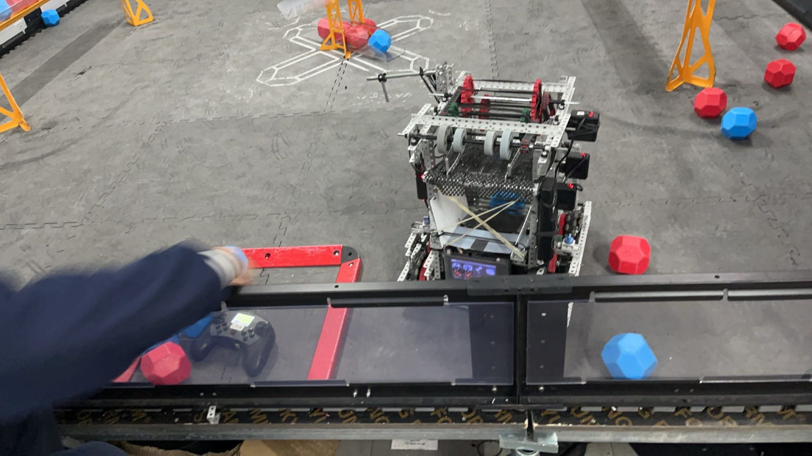
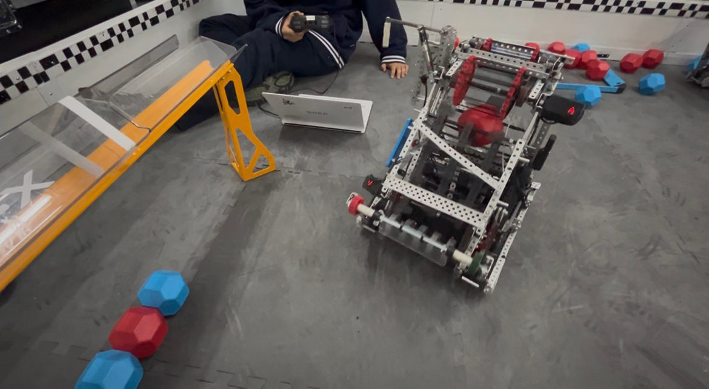
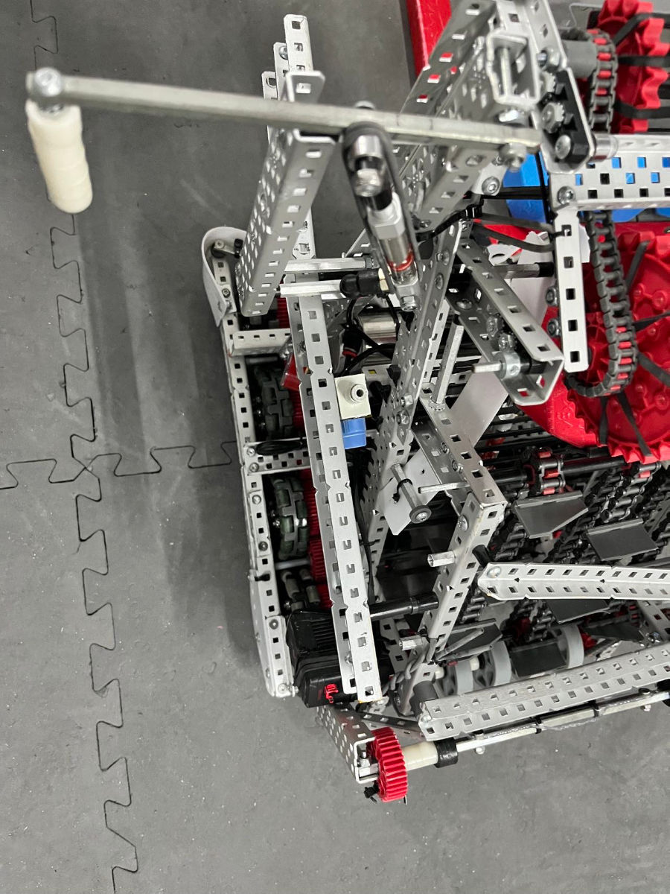
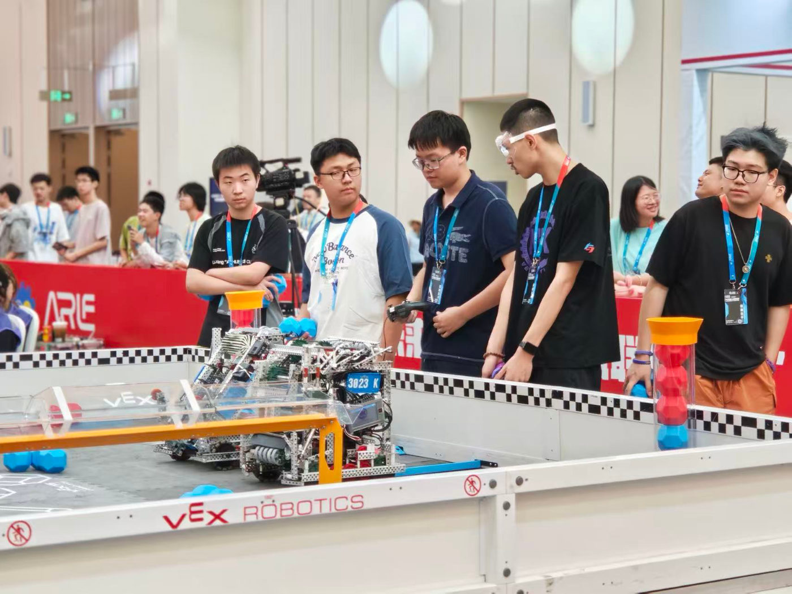
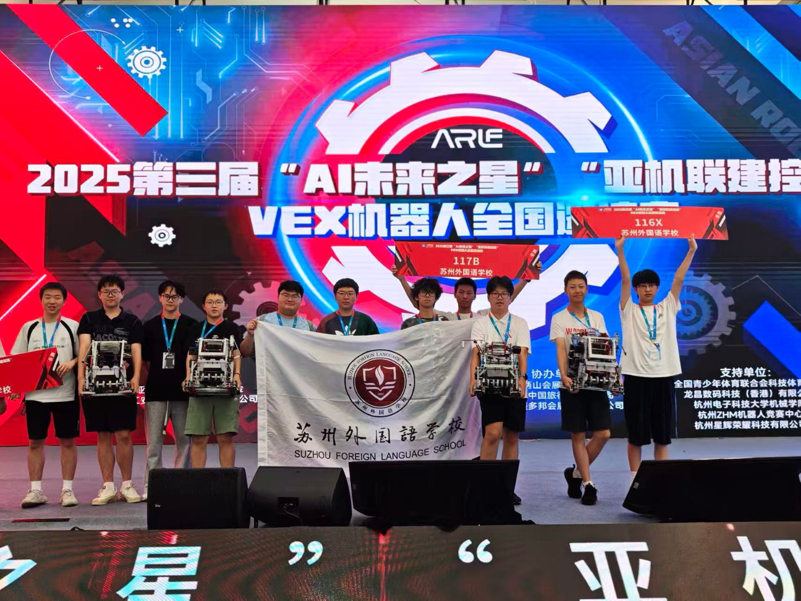
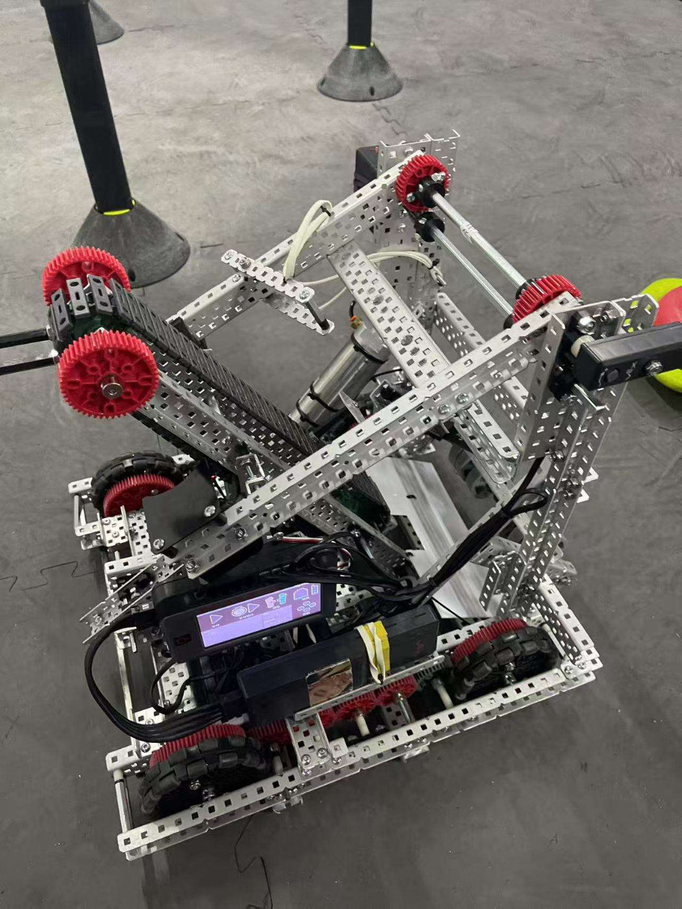
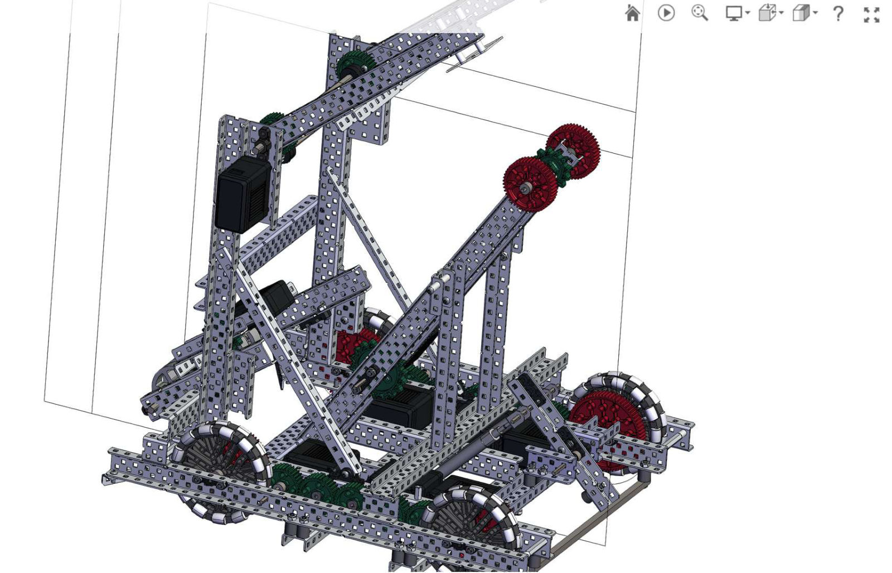

# Photos

## 2025–26 *Push Back*, team 117V

### Suzhou, November 2025

*Our trophy from Suzhou, where we were Division 2 champions and overall runner-up, with passes from the season's events.*

*Our school's teams at the Suzhou event: 117V with sister teams 117Z and 3778D, and our teacher.*

### The robot

*117V on the field, next to a loader.*

*The Gen 3 assembly in SolidWorks.*

*From the driver station during practice.*

*Testing on our practice field.*

*Top view: the piston-driven arm, the chain run and the rollers.*

### Huzhou invitational, August 2025

*A qualification match at Huzhou. 117V was allied with team 3023K (in front) in qualifier 12.*

*Gen 2 in the pits at Huzhou.*

*Our school's teams on stage at Huzhou, with their robots.*

### WRCT 2025 selection, August 2025

*Our club's sister team 117B at the WRCT 2025 selection, 16 August 2025, where they won the high-school division. I helped them during development, in the pits and with code.*

More renders and test photos, with what each one shows, are in the [2025–26 design log](seasons/2025-26-push-back/design-log.md).

## 2024–25 *High Stakes*, team 117C

|  |  |
|---|---|
| *The "V2.0" robot, March 2025* | *The same robot in SolidWorks* |
