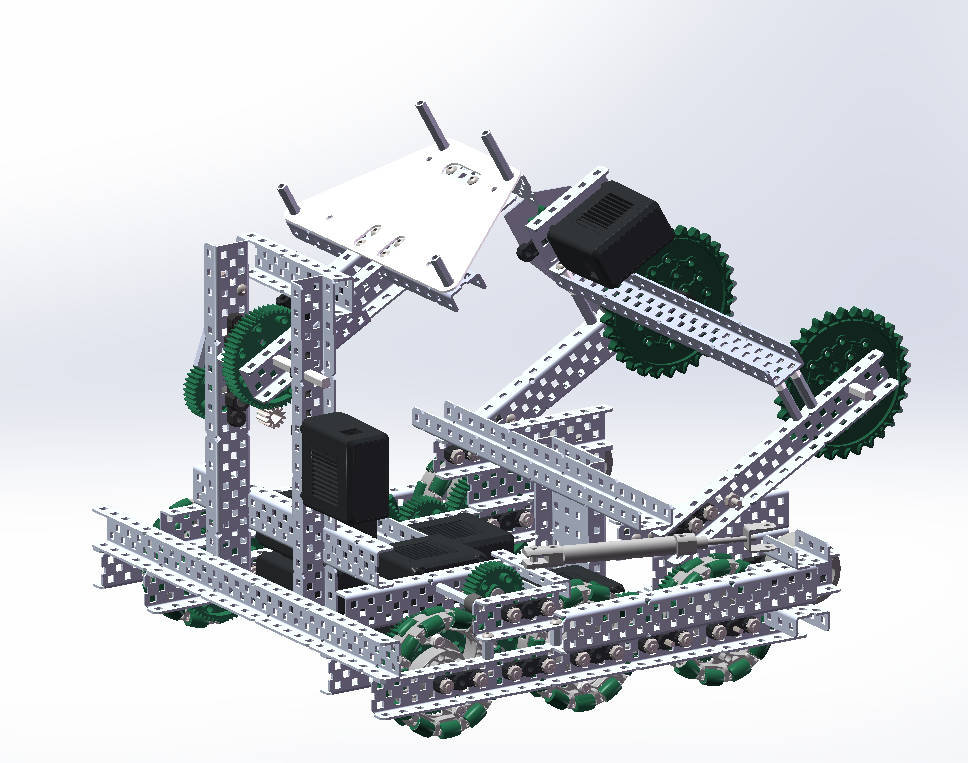
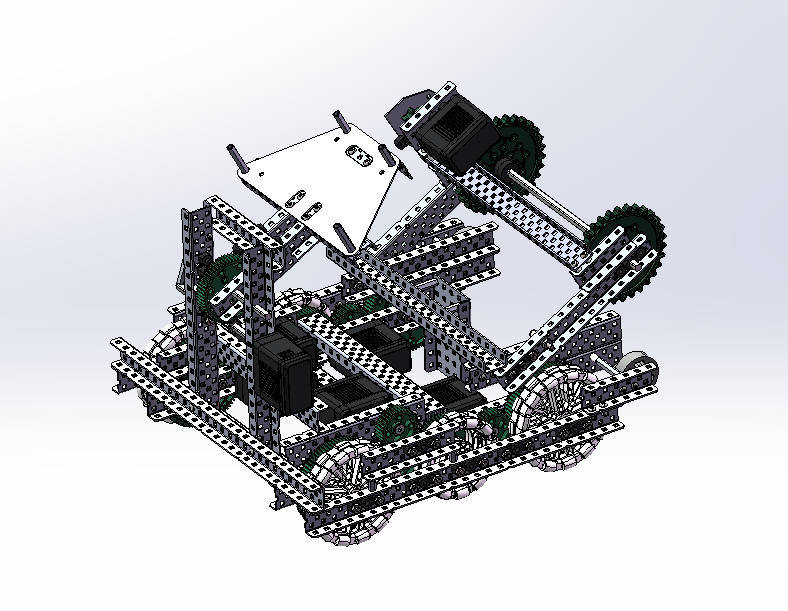
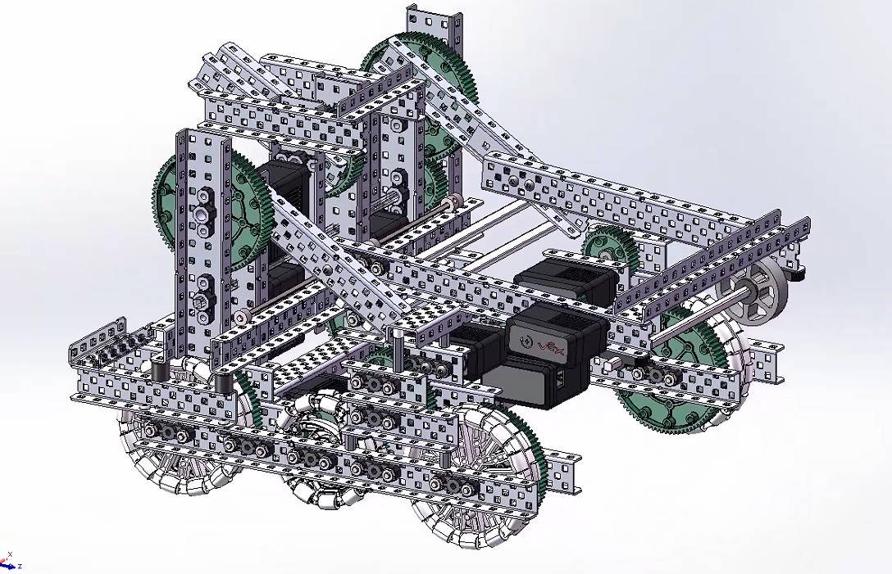

# 2023–24 *Over Under* (Grade 9), team 117C

I joined the SFLS robotics club this year. As a new member I sourced parts, scouted other teams and filmed matches.

## One robot, four versions

The club's robot this season went through four versions. Each was documented as a step-by-step build guide in Feishu, with CAD renders, written by our mentor and the team.

| Version | What changed | Guide |
|---|---|---|
| **V2.0** | 360 rpm drive; built in a catapult variant and a climbing variant | [v2.0.pdf](build-guides/v2.0.pdf) |
| **V2.5** | Slower, stronger drive: 6 motors at 36:84 → 257 rpm on 6 wheels. Catapult on a 5:1 reduction, a 600 rpm direct-drive intake, a side climb, twin-piston wings. | [v2.5.pdf](build-guides/v2.5.pdf) |
| **V3.0** | A 55 W design | [v3.0.pdf](build-guides/v3.0.pdf) |
| **V4.0** | Climbing robot built around 5.5 W motors, on 4 in wheels | [v4.0.pdf](build-guides/v4.0.pdf) |

|  |  |  |
|---|---|---|
| V2.0 | V2.5 | V3.0 |

*The original guides were split into chapters (chassis, intake, climb, latch, launcher) for each variant. For this repository each version's chapters were merged into one PDF, and duplicate chapters shared by two variants were kept once. No content was changed.*

**Next season →** [2024–25: writing the code](../2024-25-high-stakes/README.md)
