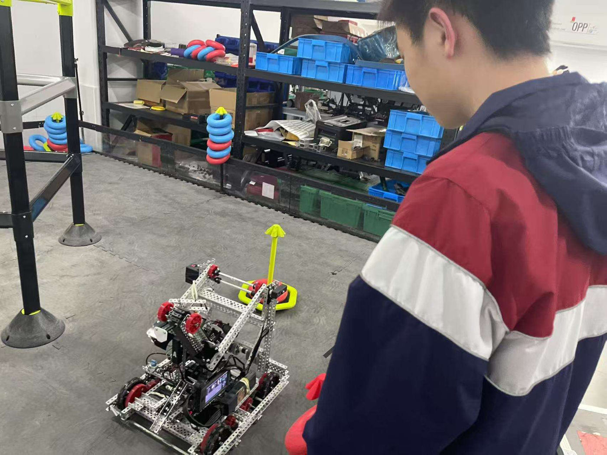

# 2024–25 *High Stakes* (Grade 10), team 117C

This was the season I started programming. I became the team's programmer and then its lead programmer, and with our mentor I modelled the robot in SolidWorks.

## The robot: "V2.0"


*The "V2.0" model (SolidWorks, eDrawings web export, December 2024): a conveyor with hooks, a lift arm on 84T gears, and a 2 in rubber-wheel intake.*

|  |  |
|---|---|
| *The built robot, March 2025* | *Testing code at the field, March 2025* |

The robot was documented as step-by-step build guides, co-written by our mentor, my teammates and me: [chassis](build-guides/01-chassis.pdf), [intake](build-guides/02-intake.pdf), [conveyor](build-guides/03-conveyor.pdf) and [lift arm](build-guides/04-lift-arm.pdf).

## Code

The project, "117c", grew from 699 lines of autonomous code in early March 2025 to **908 lines** by late May. Alongside left- and right-side routines, I wrote separate ones for attacking and defending, for qualification and final matches, and for skills.

| File | Lines | What it is |
|---|---|---|
| [`code/autons.cpp`](code/autons.cpp) | 908 | All the autonomous routines |
| [`code/autofunction.cpp`](code/autofunction.cpp) | 113 | Arm, intake and drive helpers |
| [`code/user.cpp`](code/user.cpp) | 95 | Driver control |
| [`code/main.cpp`](code/main.cpp) | | Competition set-up, the auton selector, and the arm controller below |

### A feedback controller for the lift arm

For the lift arm I wrote a proportional controller that reads a rotation sensor and drives the arm to 37° at the press of a button (`arm()` in [`main.cpp`](code/main.cpp)):

```cpp
error_a = t_angle - pre_angle;      // t_angle = 37 degrees
speed = 20 + error_a * p;           // p = 0.8: constant base power plus a correction proportional to the error
climb.spin(fwd, speed, pct);
...
if (fabs(pre_angle - t_angle) < 2.5 and Tarm > 350) break;   // within 2.5 degrees, after 350 ms
```

It also handles the sensor reading wrapping past 360° back to 0°.

**Next season →** [2025–26: captain, and three robots](../2025-26-push-back/README.md)
