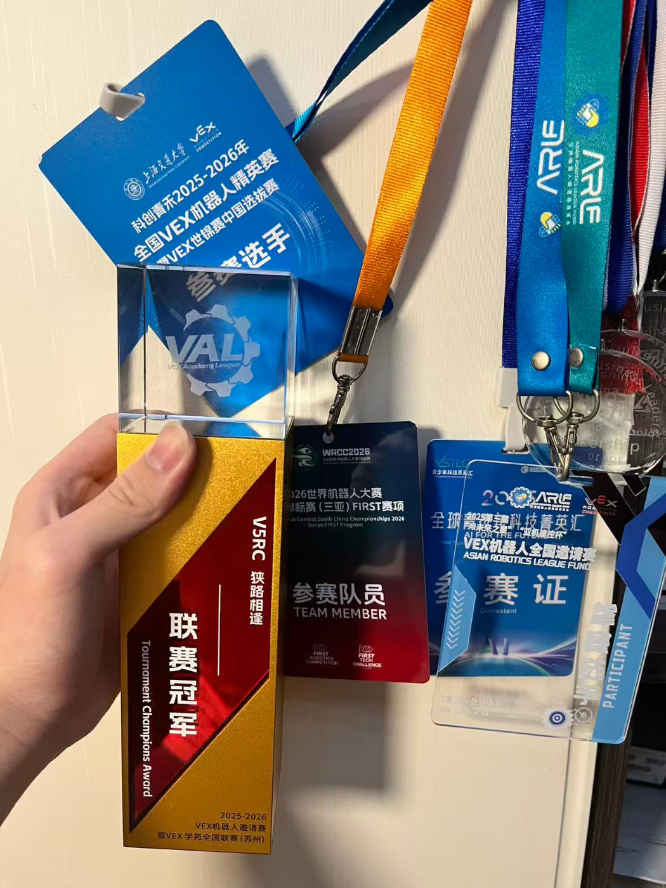
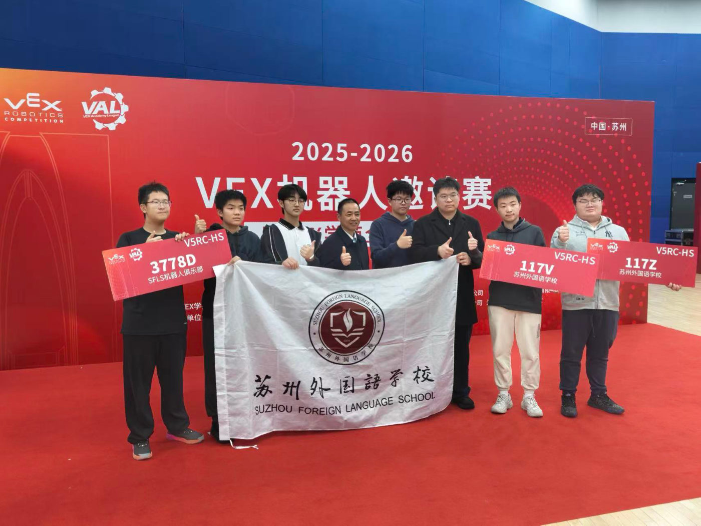

# 2025–26 *Push Back* (Grade 11): team 117V, captain

**Division 2 champion and overall runner-up** at the 2025–26 VEX Robotics Invitational & VEX Academy National League (Suzhou, November 2025; 61 teams from 9 provinces). Then the VEX World Championship China selection (Shanghai, February 2026).

## The season

This was my first season as captain. Team 117V had six members, and I was the lead programmer: I wrote every autonomous routine. With our mentor I also built the robot's SolidWorks models.

We built three robots. **Gen 1** could not store enough blocks, and its rubber-band rollers tangled with other robots. **Gen 2** fixed both with a new drivetrain, a rubber-wheel intake on a floating rail, double-row storage and a belt-and-paddle transfer.

In August our club's sister team 117B took a robot of the Gen 2 design to the WRCT 2025 selection and won the high-school division. While upgrading our own robot to Gen 2, I helped them during development, in the pits and with their code. Watching the design compete showed us that the double row leaked blocks, the autonomous had no real advantage, and blocks jammed side by side. So we designed **Gen 3**: a single S-shaped channel, three rollers deliberately run at different speeds, and a PC plate that centres the robot on the goal. In November, Gen 3 won Division 2 in Suzhou and reached the final.

The full reasoning, decision by decision, is in the **[design log](design-log.md)**.

## In this folder

| | |
|---|---|
| [design-log.md](design-log.md) | Every design decision, Gen 1 → Gen 2 → Gen 3, with reasons and evidence |
| [code/](code/README.md) | The autonomous routines (C++): strategy, how they changed, how the code grew and was cut back |
| [notebook/](notebook/README.md) | The full engineering notebook, the season improvement record, the concept study and the build guides (originals in Chinese, summarised in English) |
| [cad/](cad/README.md) | Our custom SolidWorks parts |
| [media/](media/) | Renders and photos |

## Timeline

| When | What happened | Robot |
|---|---|---|
| Start of the season | Concept study and brainstorm; ramp robot chosen; Gen 1 built and tested | Gen 1 |
| Jul–Aug 2025 | Gen 2 built; its autonomous code written | Gen 2 |
| 16 Aug 2025 | WRCT 2025 selection: our sister team 117B wins the high-school division with a Gen 2-design robot; I helped in development, in the pits and with code. Three problems with the design found. | Gen 2 |
| 22–24 Aug 2025 | Huzhou invitational ([RE-V5RC-25-0863](https://events.vex.com/robot-competitions/vex-robotics-competition/RE-V5RC-25-0863.html)): 29th of 54 ([photos](../../media.md#huzhou-invitational-august-2025)) | Gen 2 |
| Aug–Nov 2025 | Gen 3 designed and built | Gen 3 |
| **21–23 Nov 2025** | **Suzhou: Division 2 champion, overall runner-up** (below) | Gen 3 |
| Dec 2025 – Jan 2026 | Autonomous routines refined; Kunshan event ([RE-V5RC-26-4036](https://events.vex.com/robot-competitions/vex-robotics-competition/RE-V5RC-26-4036.html)) | Gen 3 |
| 1–4 Feb 2026 | **VEX World Championship China selection**, Shanghai (科创青禾 全国VEX机器人精英赛暨VEX世锦赛中国选拔赛, [RE-V5RC-25-0839](https://events.vex.com/robot-competitions/vex-robotics-competition/RE-V5RC-25-0839.html)): 34th of 40 in our division | Gen 3 |

## Suzhou, 21–23 November 2025

*2025-2026 VEX 机器人邀请赛暨VEX学苑全国联赛* (VEX Robotics Invitational & VEX Academy National League), high-school V5, Suzhou Olympic Sports Center. The event was open to teams from across China, and its stated purpose was to select teams for the VEX World Championship China selection. **61 teams from 9 provinces and municipalities** took part, in two divisions; each division's elimination winner went to the final. Official record: [RE-V5RC-25-3593](https://events.vex.com/robot-competitions/vex-robotics-competition/RE-V5RC-25-3593.html).

**Qualification (Division 2, 31 teams):** 9th, 5 wins and 3 losses.

**Eliminations**, allied with team **14882Z**:

| Round | Opponents | Score |
|---|---|---|
| Round of 16 | 18964W + 1418C | **won** 94–20 |
| Quarterfinal | 93333C + 58888A | **won** 47–43 |
| Semifinal | 33398A + 1418A | **won** 46–38 |
| **Division 2 final** | 41999C + 3778D | **won** 56–15 |
| Final, match 1 | 18965J + 5138K | **won** 47–26 |
| Final, match 2 | 18965J + 5138K | lost 22–60 |
| Final, match 3 | 18965J + 5138K | lost 3–110 |

**Award: Tournament Finalists (runner-up).**

*Our trophy from Suzhou, with passes from the season's events, including the VEX World Championship China selection in Shanghai and the Huzhou and Kunshan invitationals.*

*Our school's teams at Suzhou: 117V with sister teams 117Z and 3778D, and our teacher.*

During the event, a result was disputed. I explained our case to the referees on my own, in my second language. They ordered a rematch, and we won it. (The online record shows only the final result of each round.) → [leadership](../../leadership.md)
