# 2025–26 *Push Back*: design log

We built three robots this season. Each one was replaced because testing or competition showed something it could not do. This page follows that chain: the problem we saw, the options, what we chose and why, and what happened next.

**Sources.** Everything here comes from our own documents, cited by page. **IR** is the season improvement record, written by our mentor, my teammates and me ([PDF](notebook/2025-26-improvement-record.pdf)). **NB** is the engineering notebook ([PDF](notebook/2025-26-engineering-notebook.pdf)). The build guides are in [notebook/build-guides](notebook/build-guides/), and the CAD (which I built with our mentor) is in [cad/](cad/README.md).

| | Gen 1 | Gen 2 | Gen 3 ("S machine") |
|---|---|---|---|
| **Shape** | Roller-cascade intake, rubber-band rollers, 29 holes wide | Ramp robot: front intake, rear scoring, rubber-wheel intake, double-row storage, belt-and-paddle transfer, 27 holes wide | Single S-shaped storage channel, rollers at different speeds, PC centring plate |
| **Fate** | Replaced: too little storage, rollers tangled | Its design won WRCT 2025 for our sister team 117B; replaced because it leaked blocks and jammed | Division 2 champion and runner-up at Suzhou, Nov 2025 |
| | 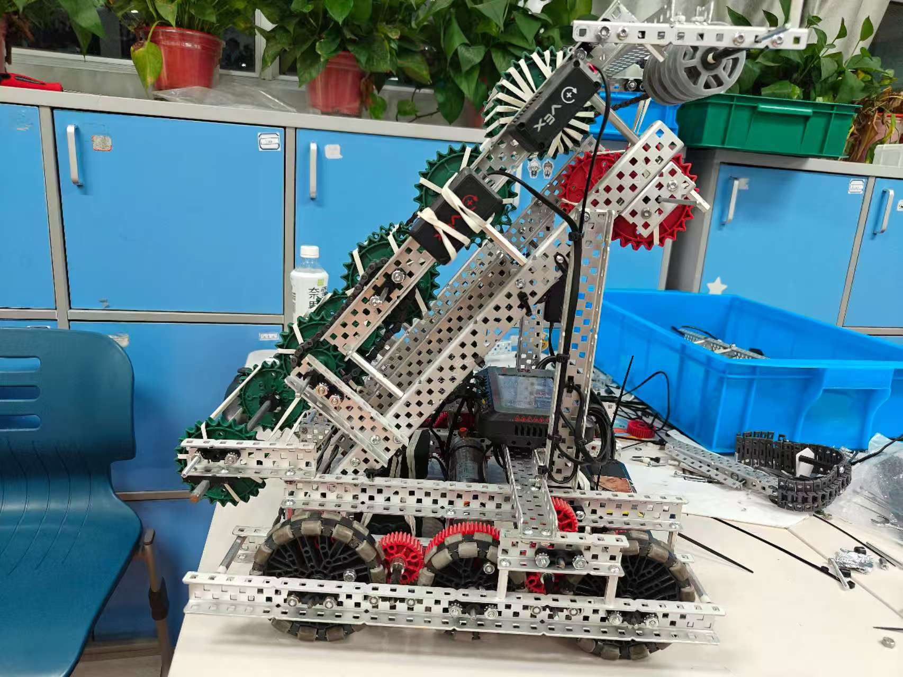 | 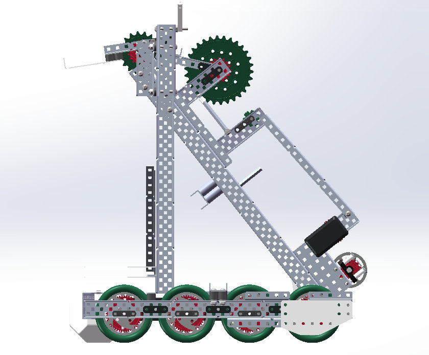 | 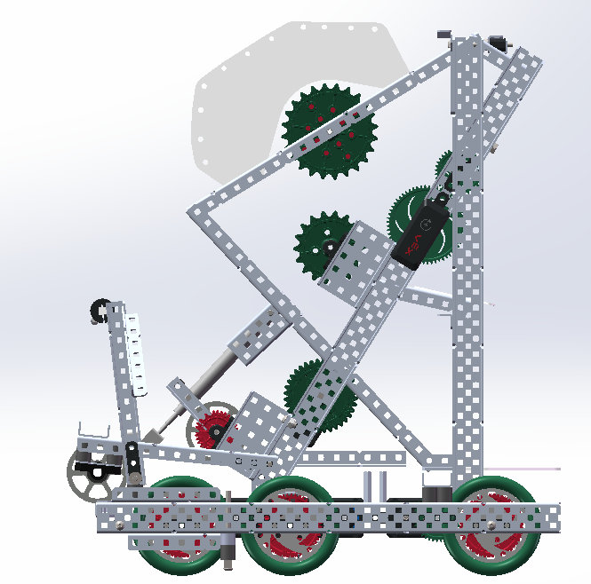 |

---

## How we started: choosing a robot type

Before building, the notebook compared three robot types (NB p.8–9):

| Type | For | Against |
|---|---|---|
| Lift robot | Simple, low centre of gravity, drives under the long goal | Unstable while scoring, stores few blocks, drops them from the back |
| "Big stomach" | Stores the most blocks, stable, strong in contact | Heavy and slow, wide enough to get stuck between goals |
| **Ramp robot** | **Agile, enough storage, front intake / rear scoring suits loader → long goal** | Weaker grip on blocks, less pushing power |

**We chose the ramp robot:** it had no major weakness and balanced storage against agility. A concept study ([PDF](notebook/2025-26-concept-study.pdf)) had already worked through the motor budget. The V5 rules cap total motor power at 88 W, which allows only a few mixes of 11 W and 5.5 W motors. The notebook set a rule we kept all season: give one motor several jobs where possible, and never add a motor just to use up the 88 W (NB p.5–6).

---

## Chapter 1. Gen 1 → Gen 2

The team meeting that opened Gen 2 (IR p.1) started from two failures of Gen 1: **it could not store enough blocks**, and **its rubber-band rollers tangled with other robots**. We also wanted a way to knock opponents' blocks out of goals.

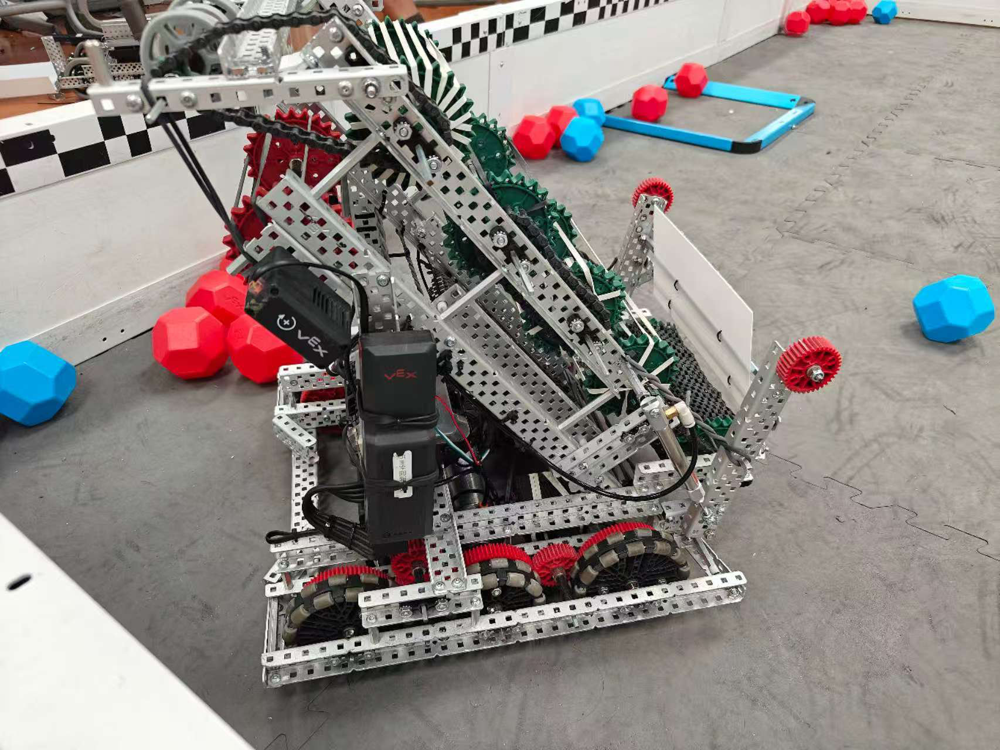

| Subsystem | Problem | Options | Decision and reason | Evidence |
|---|---|---|---|---|
| **Drive ratio** | | | **36:48** gearing on 3.25 in omni wheels with 600 rpm motors: 450 rpm at the wheel, about 76.6 in/s (1.95 m/s) free speed | IR p.2; `main.cpp` chassis set-up |
| **Wheels per side** | Must cross the barrier and park without getting stuck | 2, 3 or 4 wheels | **4**: the turning centre sits closer to the middle of the robot, it crosses the barrier more easily, and it doesn't snag in the park zone | IR p.2–3 · 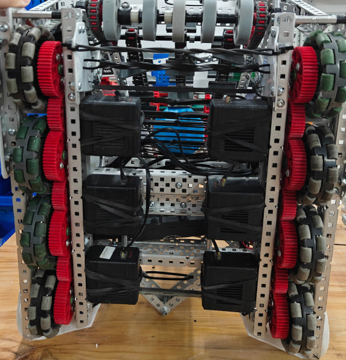 |
| **Chassis size** | Gen 1 was 29 holes wide; parking alone was very tight | 29 vs 27 wide | **30 × 27 holes.** At 27, parking became easy | IR p.2; [Gen 1](notebook/build-guides/gen1-chassis.pdf) and [Gen 2](notebook/build-guides/gen2-chassis.pdf) chassis guides |
| **Intake surface** | Rubber bands tangled with other robots in contact and were pulled off the rollers | Bands vs wheels | **Rubber wheels** | IR p.3; NB p.15 |
| **Intake wheel size** | | 1.625 in vs 2 in, both tested | **2 in**: it picked blocks up better, because the larger radius grips more | IR p.3 |
| **Intake mounting** | Stiff wheels against hard blocks jammed when the intake was fixed | A sliding slot cut in a PC plate, or a rail built from bearing blocks | **Floating intake on a bearing-block rail.** The PC slot was dropped because the season allowed only 12 PC plates and we needed them elsewhere | IR p.4 · 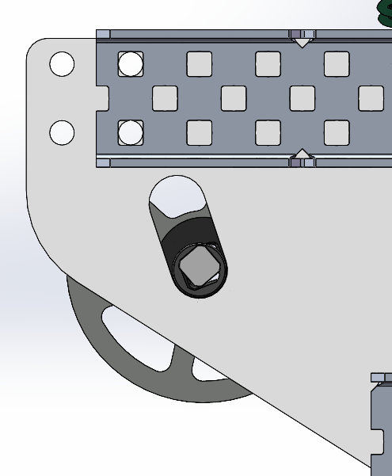 |
| **Storage** | Gen 1 stored too few blocks | | **Double-row storage** | IR p.5 |
| **Transfer** | Blocks were passed up one roller at a time; the gearing was complicated and the band rollers dragged on each other | | **Belt with paddles**, which puts less pressure on the blocks | IR p.6 · 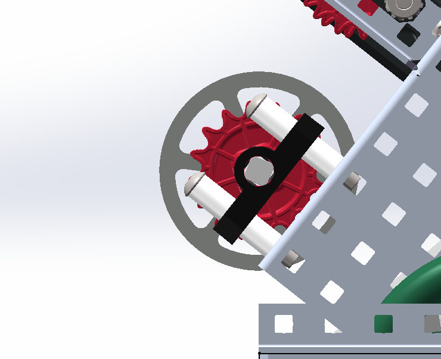 |
| **Shooter** | | | A **30T and an 18T sprocket** squeeze each block out; running the roller backwards stops blocks entering | IR p.7–8 · 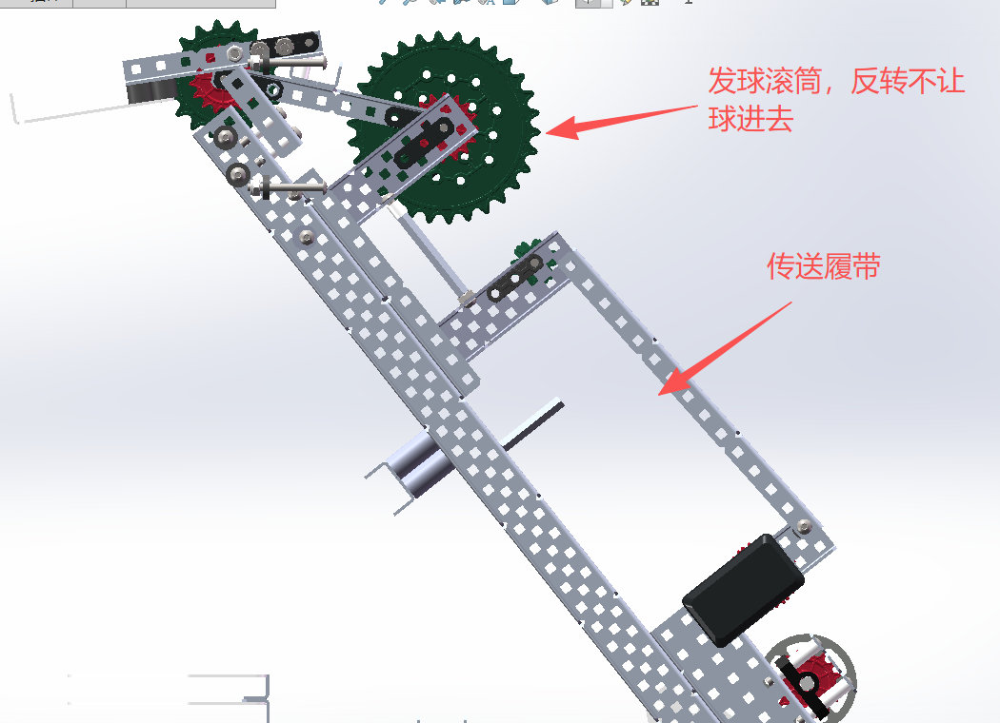 |

### The descorer: four tries

Knocking opponents' blocks out of a goal took four changes (IR p.9–12):
1. **The idea:** hit the blocks with a flat face, using the robot's own acceleration.
2. **Too heavy:** the aluminium version weighed too much, so it became a **bent polycarbonate (PC) plate**. The build guide specifies the bends: 90° at 30 mm, 30° at 15 mm ([guide](notebook/build-guides/gen2-middle-goal-plate.pdf)).
3. **Didn't fit:** the plate was **cut back to match the goal's notch**.
4. **Wrong angle:** hitting flat and hitting at an angle gave different results, so we added a mount that holds the plate **at an angle**.

| 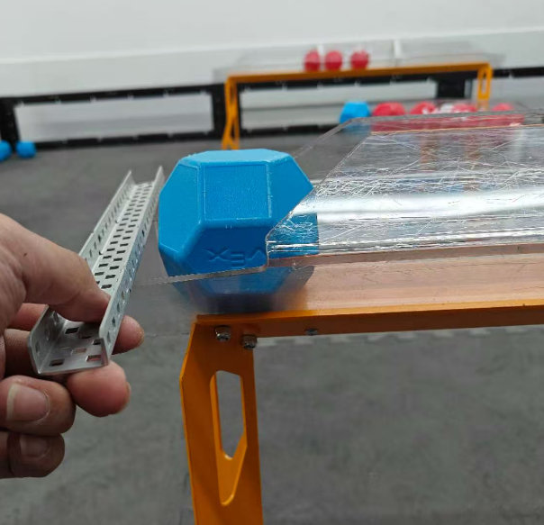 | 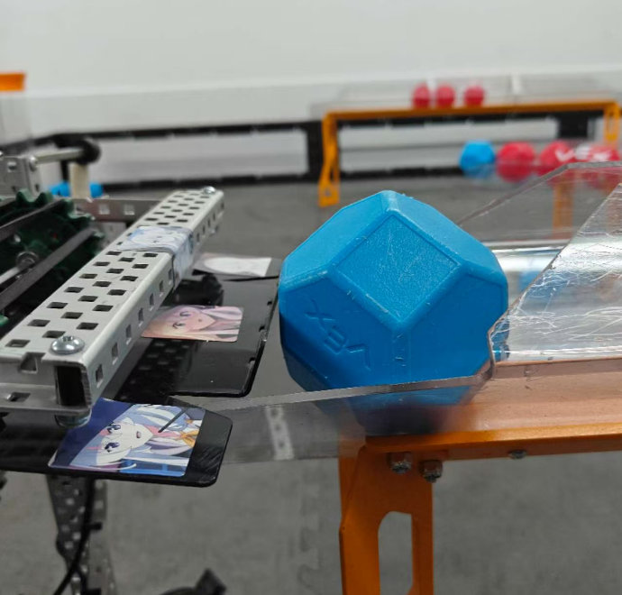 | 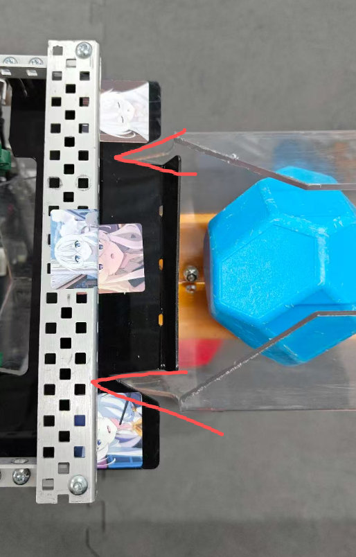 |
|---|---|---|
| Aluminium test | Bent PC, notched | Angled mount |

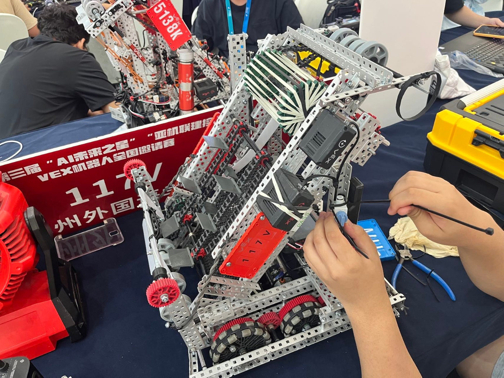

*Gen 2 in the pits at the Huzhou invitational, August 2025: the ramp with its belt and paddles.*

---

## Chapter 2. Learning from a win

On **16 August 2025** our club's sister team **117B** took a robot of the Gen 2 design to the **WRCT 2025 selection** (World Robot Contest Tournament trials) and won the high-school division (IR p.14). While we were upgrading our own robot to Gen 2, I helped 117B during development, in the pits and with their code.

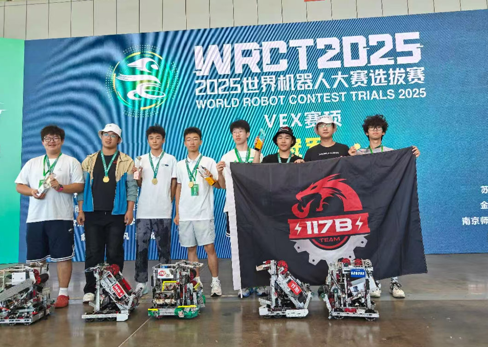

*117B at the WRCT 2025 selection.*

Winning didn't make the design right. Watching it compete showed us what Gen 2 could not do (IR p.15):
1. **Blocks leaked at the middle goal.** The double-row channel let blocks fall out when scoring low.
2. **The autonomous had no edge.** The 1 + 6 route could not take both goals.
3. **Blocks jammed side by side** while scoring.

At the next team meeting we decided to design a third robot, with two goals: **a single storage channel**, and **the ability to double-park** (IR p.15).

The idea came from watching **team 16610A** at the Mall of America event. Their robot used pistons to lift itself for a double park and stored blocks in a single channel (IR p.15). Gen 3 borrows that idea; the original design is theirs.

---

## Chapter 3. Gen 3

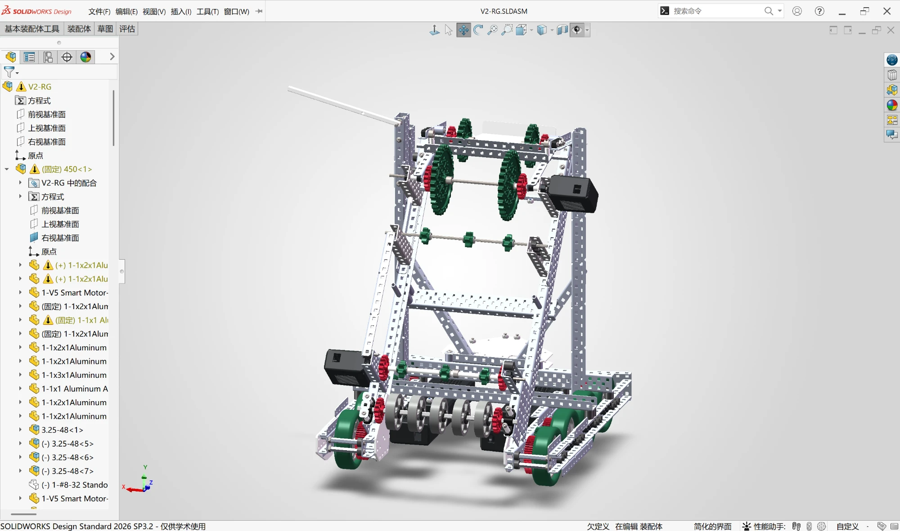

*The Gen 3 assembly in SolidWorks (file `V2-RG`), which I built with our mentor. The feature tree shows its subassemblies, such as the drive base `450` and the wheel modules `3.25-48`.*

### Motor budget: 9 motors, exactly 88 W

| Job | Motors |
|---|---|
| Drive | 6 × 11 W, 600 rpm |
| Intake | 1 × 11 W, 600 rpm |
| Feeder | 1 × 5.5 W, 200 rpm |
| Shooter | 1 × 5.5 W, 200 rpm |
| **Total** | **9 motors, 6×11 + 11 + 5.5 + 5.5 = 88 W** |

(IR p.16)

### One channel, the same capacity: the S-path

A single channel would normally hold fewer blocks than two rows. To keep Gen 2's capacity, the storage path changed **from a straight ramp to an S shape** (IR p.17).

|  | 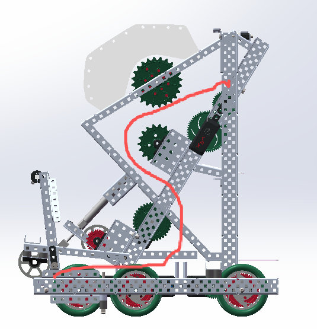 |
|---|---|
| Gen 3 in SolidWorks | The S-shaped path |

### Rollers at 20 %, 30 % and 80 %

The first test of the new intake failed: with all three roller motors at 100 %, blocks shot straight through and the robot could not hold them (IR p.18). The fix was to run the three rollers at **different speeds, 20 %, 30 % and 80 %**. That way blocks bunch up in the channel instead of passing through, and more of them fit (IR p.19–20).

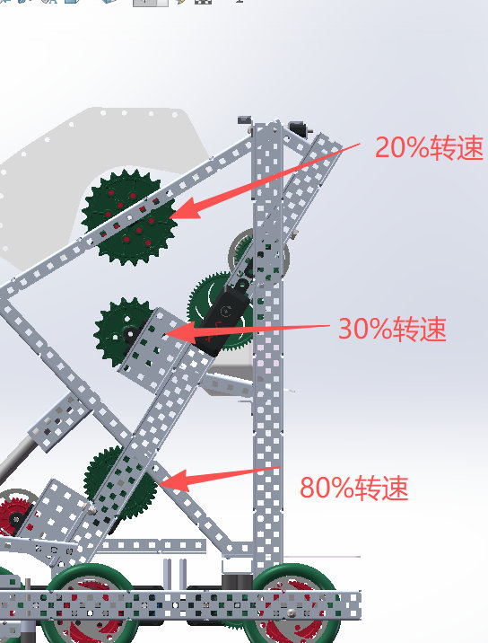

The autonomous code shows the result: the `lanyou` routine collects three blocks from the field and three more from a loader before scoring anything, so **six blocks are on board at once**.

### Lining up: aluminium triangle → PC centring plate

To help our driver line up quickly, we put a triangle on the back of the robot that slots into the goal's notch (IR p.20). The aluminium version centred badly, so we **drew a PC plate in CAD, shaped from the goal's own triangle** (IR p.21). I modelled it with our mentor; it is the part `对位板3` ("centring plate 3") in [cad/](cad/README.md).

| 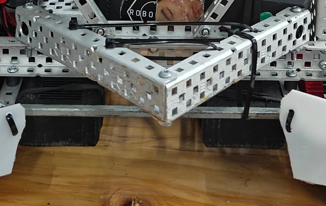 | 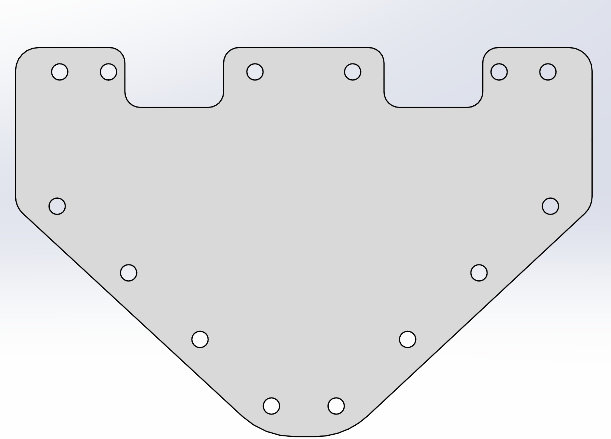 | 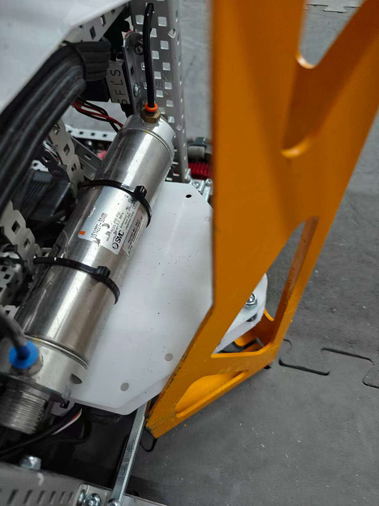 |
|---|---|---|
| Aluminium triangle | The plate in CAD | The plate on the robot |

### Before every match

The improvement record ends with a pre-match checklist for Gen 3 (IR p.21–22): every piston linked to its stop, the scoring-wheel bands in place, the first-stage guide standoffs not bent, the loader PC plate not cracked.

---

## Smaller fixes along the way

From the notebook's problem-and-fix pages (NB p.10–16):

| Problem | Fix |
|---|---|
| Missed blocks at the long goal when the robot wasn't lined up | A PVC plate plus an aluminium guide that self-centres the robot as it drives in |
| Blocks entering the belt two at a time and jamming on a gear | Two PVC plates that funnel blocks into single file; a short reverse clears the rare jam |
| Blocks stopping on the smooth loader plate | A zip tie on the plate, so a falling block hits it and rolls into the intake |
| Chain damaged in contact | Chain moved inside the frame, behind a protective crossbeam |
| The top roller too soft to push blocks into the middle goal | Extra rubber bands on the top roller |

---

*More photos of the 2025–26 robots: [media.md](../../media.md).*
